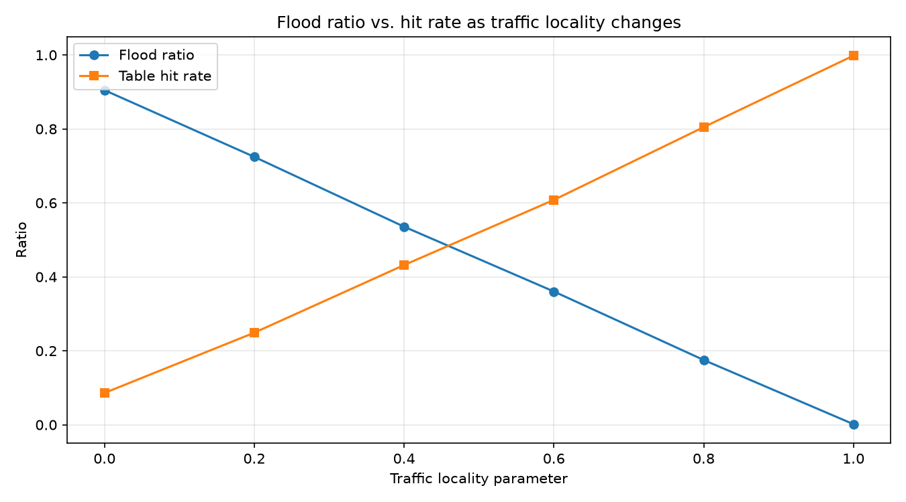
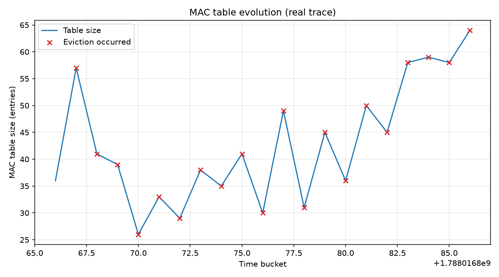

## Components

| File | Responsibility |
|---|---|
| `include/MacAddress.hpp` | 6-byte MAC representation, broadcast/multicast detection, hashing |
| `include/Frame.hpp` | The unit of data flowing through the simulator |
| `include/MacTable.hpp` | `learn()` / `lookup()` (lazy aging) / `age_out()` (active sweep) |
| `include/Switch.hpp` | The 4-outcome forwarding decision tree |
| `include/TrafficGenerator.hpp` | Synthetic traffic with a tunable **locality** parameter |
| `include/TraceReader.hpp` | Parses a `tshark`-exported real pcap trace into `Frame`s |
| `include/CliArgs.hpp` | Minimal `--key=value` CLI argument parsing |
| `include/StatsCollector.hpp` | Time-bucketed statistics and CSV output |
| `tests/test_main.cpp` | Catch2 unit tests for the forwarding decision tree |
| `scripts/plot_results.py` | Generates all analysis plots from the CSV output |

## Forwarding logic

Every incoming frame first **learns** its source MAC/port (regardless of outcome), then
resolves to exactly one of four outcomes:

1. **Unicast hit** — destination MAC known, on a different port → forward there
2. **Flood (unknown unicast)** — destination MAC not in the table → flood all ports except ingress
3. **Flood (broadcast/multicast)** — destination is broadcast/multicast → flood all ports except ingress
4. **Drop (same port)** — destination MAC known, but on the *same* port the frame arrived on → drop

## Design decisions

- **MAC as `std::array<uint8_t,6>`, not `std::string`** — avoids parsing overhead and enables
  a cheap custom `std::hash` specialization for `unordered_map` table storage.
- **Two aging strategies, both implemented**: `lookup()` does lazy eviction (a stale entry is
  only removed when accessed), and `age_out()` does an active sweep, called once per stats
  bucket, so the table-evolution graph reflects real-time decay rather than only decay-on-access.
- **Real trace has no port information.** A single-NIC `tshark` capture cannot know which
  switch port a frame "arrived on" in a multi-port topology. Ingress port is therefore
  inferred by hashing the source MAC — a documented modeling assumption, not a limitation
  hidden from the reader.
- **Hit rate excludes broadcast frames from its denominator** (`hits / (hits + unknown-unicast
  floods)`). Broadcast floods are mandatory by protocol, not a table miss — mixing them in
  would understate hit rate for reasons unrelated to table performance.
- **Bucket size must match the input's timestamp scale.** Synthetic traffic uses small
  integer timestamps (frame index); the real trace uses microseconds-since-epoch. A fixed
  bucket size would silently collapse one of the two into a single bucket.

## Building

```bash
python3 -m venv .venv
source .venv/bin/activate
pip install pandas matplotlib

cmake -S . -B build
cmake --build build
```

## Running

Synthetic traffic:
```bash
./build/simulator --input=synthetic --num-hosts=500 --locality=0.8 --num-frames=5000 \
  --recent-window=10 --aging-ttl=50 --bucket-size=250 \
  --stats-out=data/stats.csv --table-evolution-out=data/table_evolution.csv
```

Real captured traffic (requires `tshark`):
```bash
sudo tshark -i <your-interface> -a duration:20 -w /tmp/capture.pcapng
sudo mv /tmp/capture.pcapng traces/capture.pcapng
sudo chown $USER:$USER traces/capture.pcapng
tshark -r traces/capture.pcapng -T fields \
  -e frame.time_epoch -e eth.src -e eth.dst -e frame.len -e frame.number \
  > traces/capture.tsv

./build/simulator --input=trace --trace-file=traces/capture.tsv \
  --bucket-size=1000000 --stats-out=data/stats_trace.csv \
  --table-evolution-out=data/table_evolution_trace.csv
```

Run the unit tests:
```bash
./build/unit_tests
```

Generate plots from any CSVs in `data/`:
```bash
python3 scripts/plot_results.py
```

## Results

Sweeping the locality parameter (0.0 → 1.0, 500 hosts, 5000 frames, aging-ttl=50) shows a
clean, monotonic trade-off: flood ratio falls from ~1.0 to ~0.0 while table hit rate rises
from ~0.05 to ~0.95 as traffic locality increases.



The MAC table's evolution under real captured WiFi traffic shows a sawtooth pattern —
growing as new hosts are learned, then dropping sharply when the aging sweep evicts
stale entries (red markers):



Real ambient WiFi traffic, captured via `tshark`, is dominated by broadcast/multicast
control chatter (mDNS, ARP, SSDP, IPv6 neighbor discovery) — roughly 94% of the 2039
captured frames were broadcast/multicast, versus a table hit rate near 100% for the small
number of genuine unicast conversations. This contrasts instructively with the synthetic
generator, which isolates the locality effect by construction.

## Testing

6 Catch2 test cases (11 assertions) cover: fresh-table flooding, learned-MAC hits,
same-port drops, broadcast handling, TTL expiry, and MAC re-learning on port migration.

## Possible extensions

- Multiple interconnected switches with a loop scenario (motivates Spanning Tree Protocol)
- VLAN-aware table (MAC+VLAN as the lookup key)
- Capacity-limited table with LRU eviction instead of pure TTL aging